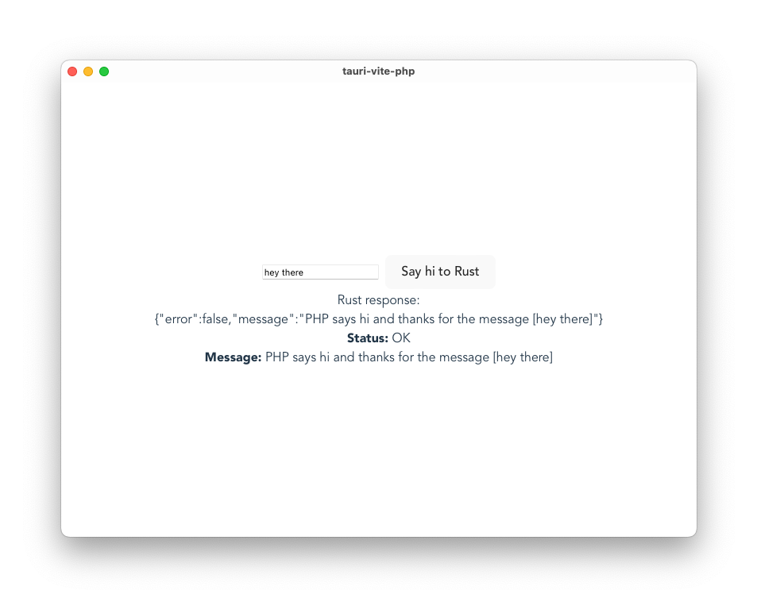

# Tauri + Svelte + TS + Vite + PHP

This [Tauri](https://tauri.app/) example app with a [Vite](https://vitejs.dev/)/[Svelte](https://svelte.dev/) front-end shows how you might communicate with a PHP PHAR file.



You can find the Tauri repo [here](https://github.com/breadthe/tauri-vite-php) and the PHP repo [here](https://github.com/breadthe/php-phar-example). The Tauri repo contains the `index.phar` binary, however, so the PHP code is mostly for reference.

## Dev & build

Follow the [Tauri guide](https://tauri.app/v1/guides/getting-started/setup/vite) to configure dev tooling.

Clone the repo and install dependencies:

```shell
npm install
```

Run in dev or build for prod:

```shell
# dev
cargo tauri dev

# build prod
cargo tauri build
```
